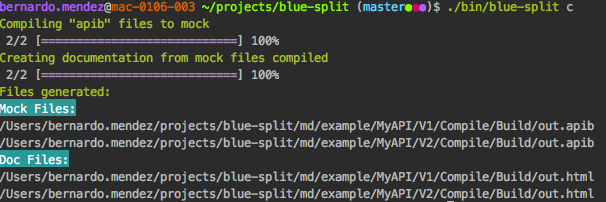

# BlueSplit

[](https://travis-ci.org/bernardosecades/bluesplit)

API Blueprint renderer.
 
You can split your API blueprint document with request/response (text-plain, json, xml ...) files and include in your main document to easily maintenance. 
 
If you need load mock server with these API blueprint documents you can process them to render all content in unique file (including content request/response files) 
and load this file in mock server like [drakov](https://github.com/Aconex/drakov) or similar.
 
The html documentation will be generated from that unique file.  

## Installation

This tool use [markdown-pp](https://github.com/jreese/markdown-pp) and [aglio](https://github.com/danielgtaylor/aglio) to include 
request/response files in API blueprint documents and generate html documentation.

### Install `markdown-pp`

```bash
pip install MarkdownPP
```

### Install `aglio`

```bash
npm install -g aglio
```

### Install some dependencies with composer

```bash
composer install
```

## Usage

Example apib file:

```apib
+ Request OK (application/json;charset=UTF-8)

    + Body

            {
                "checkIn": "YYY-mm-dd",
                "checkOut": "YYY-mm-dd",
                "occupancy": "A",
                "hotelCode": "A",
                "locationCode": "A"
            }

+ Response 200 (application/xml;charset=UTF-8)

    + Body

<!-- include markdown-pp (without spaces before) -->
!INCLUDE "Response/a.xml"
```

Where file `Response\a.xml` will have:

```xml
<csw:GetRecordsResponse xmlns:csw="http://www.opengis.net/cat/csw" xmlns:dc="http://www.purl.org/dc/elements/1.1/" xmlns:dct="http://www.purl.org/dc/terms/" xsi:schemaLocation="http://www.opengis.net/cat/csw http://localhost:8888/SpatialWS-SpatialWS-context-root/cswservlet?recordTypeId=1 " version="2.0.0" xmlns:xsi="http://www.w3.org/2001/XMLSchema-instance">
   <csw:RequestId>4</csw:RequestId>
   <csw:SearchStatus status="complete"/>
   <csw:SearchResults recordSchema="http://www.opengis.net/cat/csw" numberOfRecordsMatched="1" numberOfRecordsReturned="1" nextRecord="0" expires="2007-02-09T16:32:35.29Z">
      <csw:Record xmlns:dc="http://www.purl.org/dc/elements/1.1/" xmlns:ows="http://www.opengis.net/ows" xmlns:dct="http://www.purl.org/dc/terms/">
         <dc:contributor xmlns:dc="http://www.purl.org/dc/elements/1.1/" scheme="http://www.example.com">Raja</dc:contributor>
         <dc:identifier xmlns:dc="http://www.purl.org/dc/elements/1.1/">REC-1</dc:identifier>
      </csw:Record>
   </csw:SearchResults>
</csw:GetRecordsResponse>

```

If you execute command ``./bin/blue-split c` from this tool you will generate two files:

- Build/out.apib (with content of a.xml file)
- Build/out.html (documentation html of your API with content a.xml file)

The content of file `Build/out/apib` will be:

```apib
+ Request OK (application/json;charset=UTF-8)

    + Body

            {
                "checkIn": "YYY-mm-dd",
                "checkOut": "YYY-mm-dd",
                "occupancy": "A",
                "hotelCode": "A",
                "locationCode": "A"
            }

+ Response 200 (application/xml;charset=UTF-8)

    + Body

<!-- include markdown-pp (without spaces before) -->
<csw:GetRecordsResponse xmlns:csw="http://www.opengis.net/cat/csw" xmlns:dc="http://www.purl.org/dc/elements/1.1/" xmlns:dct="http://www.purl.org/dc/terms/" xsi:schemaLocation="http://www.opengis.net/cat/csw http://localhost:8888/SpatialWS-SpatialWS-context-root/cswservlet?recordTypeId=1 " version="2.0.0" xmlns:xsi="http://www.w3.org/2001/XMLSchema-instance">
   <csw:RequestId>4</csw:RequestId>
   <csw:SearchStatus status="complete"/>
   <csw:SearchResults recordSchema="http://www.opengis.net/cat/csw" numberOfRecordsMatched="1" numberOfRecordsReturned="1" nextRecord="0" expires="2007-02-09T16:32:35.29Z">
      <csw:Record xmlns:dc="http://www.purl.org/dc/elements/1.1/" xmlns:ows="http://www.opengis.net/ows" xmlns:dct="http://www.purl.org/dc/terms/">
         <dc:contributor xmlns:dc="http://www.purl.org/dc/elements/1.1/" scheme="http://www.example.com">Raja</dc:contributor>
         <dc:identifier xmlns:dc="http://www.purl.org/dc/elements/1.1/">REC-1</dc:identifier>
      </csw:Record>
   </csw:SearchResults>
</csw:GetRecordsResponse>
```

It will be ready to load in your mock server.


### Generate HTML Documentation and files to load in Mock Server

```bash
./bin/blue-split c [path]
```

Example 1:

```bash
./bin/blue-split c
```

If you do not put argument, the command will search by default inside of folder `md`. It will try to search all files named like `index.apib` to  process include sentences of that file
and generate output files (`out.apib` and `out.html`) in folder `Build`, if this not exist it will create it in the same level that `index.apib` file

Example content `index.apib`:

```apib
!INCLUDE "../cancel-api.apib"
!INCLUDE "../valuate-api.apib"
```

So this command will generate files:

- md/example/MyAPI/V1/Compile/Build/out.apib
- md/example/MyAPI/V1/Compile/Build/out.html
- md/example/MyAPI/V2/Compile/Build/out.apib
- md/example/MyAPI/V2/Compile/Build/out.html

Example 2:

```bash
./bin/blue-split c md/example/MyAPI/V2
```

- md/example/MyAPI/V2/Compile/Build/out.apib
- md/example/MyAPI/V2/Compile/Build/out.html

It will generate files:

## Tests

You can execute integration tests with next command:

```bash
vendor/bin/phpunit -c .
```

## Screenshots

`./bin/blue-split c`



`./bin/blue-split c md/example/MyAPI/V2`


